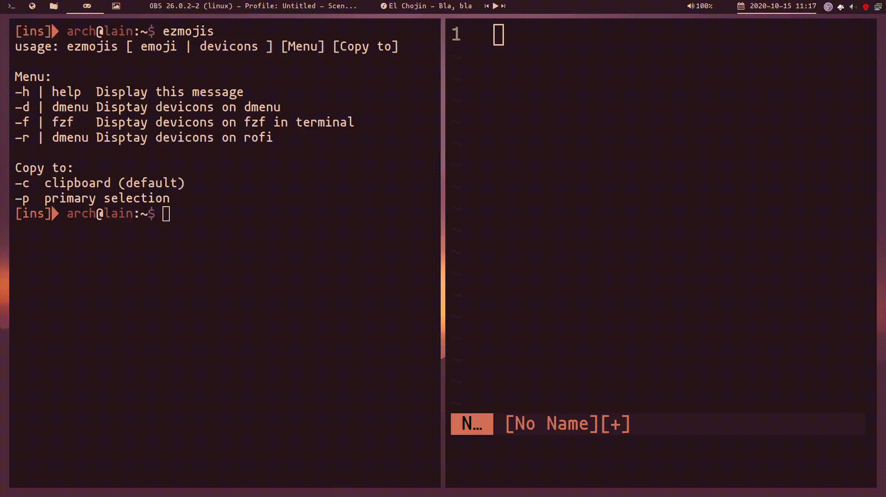

# ezmojis
Emoji Selector.

[rofi-emoji](https://github.com/Mange/rofi-emoji) is great but bloated and not easy to configure: just work on rofi and the database manage is not friendly.
Ezmojis can find and copy (clipboard or primary selection) emojis and devicons in rofi, dmenu and fzf.
The database is just a text file.

## Dependencies
- Xclip
- Obviusly a font with emoji support and devicons or glyphs.
I use : [Mononoki Nerd Fonts](https://www.nerdfonts.com/), and Noto Color Emoji

- You can choose the menu selector: [dmenu](https://tools.suckless.org/dmenu/), [rofi](https://github.com/davatorium/rofi) or [fzf](https://github.com/junegunn/fzf)


## Instalation

```sh
git clone https://github.com/andyrufasto/ezmojis.git
cd ezmojis
./install
```
## Usage:


# Customization:

The database is just a text file in `$HOME/.local/share/ezmojis/`
You can add anoter file `my_glyphs.txt` inside and run (i.e): `ezmojis my_glyphs -r`

Modify the options of rofi or dmenu on the script in `$HOME/.local/bin/ezmojis`
